# Proposed System Architecture

This document details the architecture, components, and data flow of the proposed multimedia information retrieval system. The system is composed of two distinct but parallel subsystems: **Semantic Video Search** and **Robust Music Recognition**.

## 1. System Overview

The proposed model integrates state-of-the-art deep learning models for natural language understanding with signal processing techniques for audio fingerprinting. The system is designed to handle multimodal input (video files and raw audio streams) and provide accurate, real-time retrieval of content.

---

## 2. Video Processing & Semantic Search Subsystem

This subsystem enables users to search for specific moments within video content using natural language queries (in English or Hindi). It moves beyond simple metadata search by "watching" and "listening" to the video content itself.

### 2.1 Video Input & Extraction
*   **What happens:** The system accepts raw video files (e.g., `.webm`, `.mp4`).
*   **Process:**
    *   The video file is ingested, and the audio track is separated from the visual stream using `moviepy`.
    *   The audio is converted into a standardized format (16kHz mono WAV) suitable for the speech recognition model.
*   **Why:** Deep learning speech models require clean, consistent audio input. Separating audio allows for dedicated processing pipelines without the computational overhead of decoding video frames.

### 2.2 Whisper Transcription Module (ASR)
*   **Component:** OpenAI's **Whisper** model (specifically the `small` architecture).
*   **Function:** Automatic Speech Recognition (ASR) and Language Identification.
*   **Data Flow:**
    1.  The standardized audio is fed into the Whisper model.
    2.  The model automatically detects the spoken language (e.g., Hindi, English).
    3.  It generates a timestamped transcript, mapping specific text segments to their start and end times in the video.
*   **Why:** Whisper is chosen for its robustness to accents, background noise, and technical jargon. The `small` model offers an optimal balance between transcription accuracy (especially for mixed-language "Hinglish" content) and inference speed. It natively handles Devanagari script for Hindi, ensuring accurate multilingual support.

### 2.3 Text Chunking & Preprocessing
*   **What happens:** The raw transcript is broken down into smaller, semantically meaningful units.
*   **Process:**
    *   **Sliding Window Chunking:** Instead of indexing individual sentences, the system groups consecutive segments into "chunks" (e.g., 5 segments per chunk with a 2-segment overlap).
    *   **Context Preservation:** Overlapping chunks ensure that context isn't lost at arbitrary boundaries. If a sentence starts in one segment and ends in another, the overlap captures the complete thought.
*   **Why:** Users rarely search for a single isolated word. They search for concepts. Chunking provides the embedding model with enough context to understand the *meaning* of the conversation, while keeping the unit small enough to pinpoint the exact moment in the video.

### 2.4 Vector Embedding Module (MiniLM)
*   **Component:** `paraphrase-multilingual-MiniLM-L12-v2` (Sentence-BERT).
*   **Function:** Converting text into high-dimensional vector space.
*   **Data Flow:**
    1.  Each text chunk is passed through the Transformer-based model.
    2.  The model outputs a fixed-size vector (384 dimensions) representing the semantic meaning of that text.
*   **Why:** 
    *   **Semantic Understanding:** Unlike keyword search, this model understands that "illegal user data" and "unauthorized privacy breach" are semantically similar, even if they share no words.
    *   **Multilingual Capability:** The model maps Hindi and English text into the same vector space. A query in English can find a relevant segment spoken in Hindi because their vector representations will be close together.

### 2.5 Vector Database & Indexing
*   **Component:** **FAISS** (Facebook AI Similarity Search).
*   **Function:** Efficient storage and retrieval of high-dimensional vectors.
*   **Structure:**
    *   **Index:** A flat L2 (Euclidean distance) index is used for exact similarity matching.
    *   **Metadata Store:** A parallel JSON store maps every vector ID back to the video filename, start timestamp, end timestamp, and original text.
*   **Why:** FAISS is optimized for dense vector search. It allows the system to compare a query vector against thousands of transcript vectors in milliseconds to find the nearest neighbors.

### 2.6 Semantic Search Module (Retrieval)
*   **Input:** User's natural language query (e.g., "Meta court ruling").
*   **Process:**
    1.  **Query Embedding:** The user's query is converted into a 384-dimensional vector using the same MiniLM model.
    2.  **Similarity Search:** This query vector is compared against the FAISS index to find the top-k closest vectors (Cosine Similarity).
    3.  **Result Aggregation:** The system retrieves the metadata for the matching vectors.
    4.  **Filtering:** Results are filtered by confidence score (thresholding) to remove irrelevant matches.
*   **Output:** A list of specific video segments, including the video title, the exact time range where the topic is discussed, and the matching transcript text.

---

## 3. Music Recognition Subsystem

This subsystem identifies songs from short, noisy audio samples (e.g., recorded via microphone) by analyzing their unique frequency characteristics. It implements a robust variation of the Shazam algorithm.

### 3.1 Music Audio Input
*   **Input:** 
    *   **Database:** High-quality audio files (MP3, WAV, AIFC) stored on the server.
    *   **Query:** Raw audio stream captured from a client microphone via WebSocket.
*   **Preprocessing:**
    *   **Resampling:** All audio is converted to **8,000 Hz mono**.
    *   **Bit Depth:** 16-bit PCM.
*   **Why:** 
    *   **8kHz Sampling:** Music's most distinctive features for identification lie in the 300Hz–4kHz range. Higher frequencies often contain noise or compression artifacts. Reducing the sample rate focuses on the robust "core" of the music and significantly reduces data size and processing time.
    *   **Mono:** Spatial stereo information is irrelevant for fingerprinting and doubles the processing load.

### 3.2 Fingerprint Extraction Module
*   **Function:** Converting audio into a unique, robust "star map" (Constellation Map).
*   **Process:**
    1.  **Spectrogram Generation:** A Short-Time Fourier Transform (STFT) converts the time-domain audio signal into a frequency-domain spectrogram (Time vs. Frequency vs. Intensity).
    2.  **Peak Detection:** The system scans the spectrogram to find "peaks"—points of high energy (loudness) that are higher than their surrounding neighbors. These peaks represent the dominant notes or beats.
    3.  **Anchor-Target Pairing (Combinatorial Hashing):** 
        *   Each peak is treated as an "anchor."
        *   The system looks for other peaks in a "target zone" (a specific time and frequency window shortly after the anchor).
        *   **Hashing:** A hash is created combining: `[Frequency of Anchor] + [Frequency of Target] + [Time Difference between them]`.
*   **Why:** 
    *   **Robustness:** Peaks are the most robust part of a signal. Even in a noisy room, the loudest frequencies (peaks) of the song tend to survive.
    *   **Time-Invariant:** By using the *time difference* between points rather than absolute time, the fingerprint remains valid regardless of where in the song the recording starts.

### 3.3 Fingerprint Database
*   **Storage:** A key-value store (implemented in-memory or persistent DB).
*   **Structure:**
    *   **Key:** The 32-bit Hash generated in the extraction phase.
    *   **Value:** List of `(Song_ID, Absolute_Time_Offset)` tuples.
*   **Why:** This inverted index structure allows for O(1) lookup. Given a hash from a microphone recording, the system can instantly find which songs contain that specific frequency pattern and *where* in the song it occurs.

### 3.4 Real-Time Matching Engine
*   **Input:** Stream of hashes from the microphone.
*   **Process:**
    1.  **Rolling Window Analysis:** The system analyzes audio in overlapping windows (e.g., 10 seconds).
    2.  **Offset Alignment:** For every matching hash found in the database, the system calculates: `Relative_Offset = Database_Timestamp - Recording_Timestamp`.
    3.  **Histogram Binning:** If the recording is indeed from a specific song, the `Relative_Offset` will be constant for all matches. The system groups matches by this offset.
    4.  **Confidence Scoring:** The "score" is the number of hashes that align to the same relative offset.
*   **Why:** Random noise might generate accidental hash matches, but they will be scattered randomly in time. Only the true song will produce a massive cluster of matches that all align to the same time offset (the "diagonal" in a scatter plot).

### 3.5 Retrieval Output
*   **Result:** The Song ID with the highest confidence score.
*   **Verification:** The system requires a minimum confidence threshold and consistency across multiple analysis windows to confirm a match.
*   **Output:** Song Title, Artist, and the exact position (timestamp) where the user is currently listening.

---

## 4. Data Flow Summary

1.  **Ingestion:** Videos are transcribed to text; Songs are fingerprinted to hashes.
2.  **Indexing:** Text is embedded into vectors; Hashes are stored in an inverted index.
3.  **Querying:** 
    *   **Video:** User Query → Vector → Nearest Neighbor Search → Video Segment.
    *   **Music:** Mic Audio → Spectrogram → Peaks → Hashes → Offset Histogram → Song Match.

---

## 5. Technical Specifications & Parameters

### 5.1 Video / ASR / Embeddings

*   **Chunking Strategy:**
    *   **Size:** 5 consecutive transcript segments (approx. 15-30 seconds of audio depending on speech rate).
    *   **Overlap:** 2 segments (ensures context continuity across boundaries).
    *   **Context Injection:** The video filename is prepended to every text chunk (e.g., "Video: [Title]. [Transcript Text]") to improve retrieval accuracy for title-related queries.

*   **Vector Embedding:**
    *   **Model:** `paraphrase-multilingual-MiniLM-L12-v2`.
    *   **Dimensions:** 384-dimensional dense vectors.
    *   **Normalization:** Vectors are L2-normalized before indexing.

*   **Vector Database (FAISS):**
    *   **Index Type:** `IndexFlatL2` (Exact Search).
    *   **Metric:** Euclidean (L2) distance. *Note: Since vectors are normalized, ranking by L2 distance is mathematically equivalent to ranking by Cosine Similarity.*
    *   **Retrieval:** Top-5 results returned by default.

*   **Text Preprocessing:**
    *   **Input:** Raw text from Whisper transcript (includes punctuation and capitalization).
    *   **Cleaning:** Minimal whitespace stripping; no stopword removal (to preserve semantic nuance).

### 5.2 Music Fingerprinting & Matching

*   **STFT Settings:**
    *   **Window Size:** 2048 samples (approx. 256ms at 8kHz).
    *   **Hop Length:** 64 samples (High overlap for fine time resolution).
    *   **Window Function:** Hann window.
    *   **Spectrogram:** Log-magnitude (dB scale) to match human hearing perception.
    *   **Frequency Range:** 300Hz – 4000Hz (Band-pass filter to remove rumble and high-freq noise).

*   **Peak Detection (Constellation Map):**
    *   **Neighborhood:** 10×10 (Time frames × Frequency bins). A point is a peak only if it's the maximum in this local region.
    *   **Amplitude Threshold:** Minimum 10dB above noise floor.
    *   **Target Density:** Adaptive selection to maintain ~20 peaks per second of audio.

*   **Combinatorial Hashing:**
    *   **Anchor-Target Pairing:** Each peak (anchor) is paired with up to 20 subsequent peaks (targets).
    *   **Target Window:**
        *   **Time:** 0 to 200 frames forward (approx. 0 – 1.6 seconds).
        *   **Frequency:** ±2000Hz band around anchor.
    *   **Hash Format:** 32-bit integer packing:
        *   `[10 bits] Frequency Anchor (0-1023)`
        *   `[10 bits] Frequency Target (0-1023)`
        *   `[12 bits] Time Delta (0-4095)`

*   **Matching & Scoring:**
    *   **Database:** In-memory Hash Map (Dictionary) for O(1) access.
        *   *Key:* 32-bit Hash.
        *   *Value:* List of `(SongID, Absolute_Time)` tuples.
    *   **Alignment:** Histogram binning of `(Db_Time - Sample_Time)` offsets.
    *   **Confidence Score:** Count of hashes falling into the peak histogram bin.
    *   **Rolling Window:**
        *   **Duration:** 10 seconds of audio analyzed per step.
        *   **Slide:** 2 seconds (80% overlap for continuous tracking).

---

## 6. System Architecture Diagrams

### 5.1 Video Semantic Search Pipeline

```mermaid
flowchart TD
    %% Define styles
    classDef process fill:#e1f5fe,stroke:#01579b,stroke-width:2px,color:black;
    classDef storage fill:#fff9c4,stroke:#fbc02d,stroke-width:2px,color:black;
    classDef input fill:#e8f5e9,stroke:#2e7d32,stroke-width:2px,color:black;
    classDef model fill:#e1bee7,stroke:#7b1fa2,stroke-width:2px,color:black;

    subgraph Ingestion ["📹 Ingestion & Indexing Pipeline"]
        direction TB
        Video[Video File]:::input --> Extract[Extract Audio Track]:::process
        Extract --> Whisper[Whisper 'small' Model]:::model
        Whisper --> Transcript[Timestamped Transcript]:::storage
        Transcript --> Chunk[Sliding Window Chunking]:::process
        Chunk --> MiniLM[MiniLM-L12-v2 Model]:::model
        MiniLM --> Embed[Generate Vectors 384d]:::process
        Embed --> Index[("FAISS Vector Index")]:::storage
        Transcript --> Meta[("Metadata Store JSON")]:::storage
    end

    subgraph Search ["🔍 Search & Retrieval Pipeline"]
        direction TB
        Query[User Query]:::input --> MiniLM2[MiniLM-L12-v2 Model]:::model
        MiniLM2 --> QVector[Query Vector]:::process
        QVector --> SimSearch{Cosine Similarity Search}:::process
        
        Index -.-> SimSearch
        SimSearch --> TopK[Top-k Candidates]:::process
        TopK --> Enrich[Enrich with Metadata]:::process
        Meta -.-> Enrich
        
        Enrich --> Filter{Confidence > Threshold?}:::process
        Filter -->|Yes| Result[✅ Video Segments Found]:::input
        Filter -->|No| NoResult[❌ No Relevant Results]:::process
    end
```

### 5.2 Music Recognition Pipeline

```mermaid
flowchart TD
    %% Define styles
    classDef process fill:#e1f5fe,stroke:#01579b,stroke-width:2px,color:black;
    classDef storage fill:#fff9c4,stroke:#fbc02d,stroke-width:2px,color:black;
    classDef input fill:#e8f5e9,stroke:#2e7d32,stroke-width:2px,color:black;
    classDef decision fill:#fce4ec,stroke:#c2185b,stroke-width:2px,color:black;

    subgraph Offline_Indexing ["🎵 Database Creation (Offline)"]
        direction TB
        MusicFile[("Music Database")]:::storage --> LoadAudio[Load Audio File]:::process
        LoadAudio --> Resample1[Resample to 8kHz Mono]:::process
        Resample1 --> STFT1[STFT Spectrogram]:::process
        STFT1 --> Peaks1[Extract Constellation Peaks]:::process
        Peaks1 --> Hash1[Combinatorial Hashing]:::process
        Hash1 --> StoreDB[("Fingerprint Database")]:::storage
    end

    subgraph Online_Recognition ["🎤 Real-Time Recognition (Online)"]
        direction TB
        Mic[Microphone Input]:::input --> Buffer[Rolling Buffer 10s]:::process
        Buffer --> Resample2[Resample to 8kHz Mono]:::process
        Resample2 --> STFT2[STFT Spectrogram]:::process
        STFT2 --> Peaks2[Extract Constellation Peaks]:::process
        Peaks2 --> Hash2[Generate Query Hashes]:::process
        Hash2 --> Lookup{Lookup in DB}:::decision
        
        Lookup -->|Matches Found| Align[Calculate Time Offsets]:::process
        Align --> Histogram[Offset Histogram Binning]:::process
        Histogram --> Score[Calculate Confidence Score]:::process
        Score --> Threshold{Confidence > Threshold?}:::decision
        
        Threshold -->|Yes| Match[✅ Song Identified]:::input
        Threshold -->|No| NoMatch[❌ No Match / Silence]:::process
        
        Lookup -->|No Matches| NoMatch
    end

    %% Connect Database
    StoreDB -.-> Lookup
```

